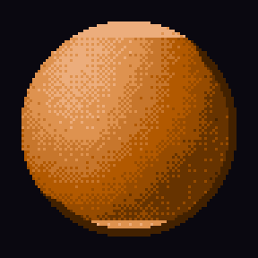

# pixelloom

Библиотека для рисования пиксель-арта кодом. Пока код пишет пиксели, браузер
показывает работу в реальном времени: видно порядок шагов, активную область и
цвет, которым идёт заливка прямо сейчас.

<p align="center">
  
  
</p>

## Установка

```bash
pip install pixelloom
```

Нужен Python 3.10 и выше. Из зависимостей только numpy и Pillow.

Посмотреть, как это выглядит, можно сразу после установки:

```bash
pixelloom
```

Команда поднимает просмотр на `http://127.0.0.1:8765/`, открывает браузер и
рисует персонажа у вас на глазах.

## Как выглядит код

```python
from pixelloom import Canvas, draw, palettes, save_png
from pixelloom.live import LiveView

view = LiveView().start(open_browser=True)
view.wait_for_viewer()

c = Canvas(48, 48, palettes.BASE16)
view.attach(c, "Первый рисунок")
i = palettes.BASE16.index_of

with view.step("тело"):
    draw.ellipse(c, 24, 28, 12, 10, i("leaf"))
with view.step("глаза"):
    c.data[24:27, 19:21] = i("ink")
    c.data[24:27, 27:29] = i("ink")
with view.step("контур"):
    draw.outline(c, i("ink"))

save_png(c, "out/hero.png", scale=8)
```

Просмотр подключается к холсту и дальше не мешается. Пресеты, кисти и любой
сторонний код рисуют как рисовали, ничего про наблюдателя не зная.

## Живой просмотр

Холст замечает каждую запись пикселей и зовёт наблюдателя. Тот сравнивает
состояние с прошлым снимком, режет разницу на порции и отдаёт их браузеру по
одной. Картинка целиком по сети не ходит: в сообщении едет либо прямоугольник
изменившейся области, либо пары «смещение, цвет», смотря что короче. Персонаж
48×48 обходится примерно в 40 КБ трафика на весь сеанс рисования.

Страница собрана как верстак:

* слева очередь работ и лента шагов, по клику любой шаг открывается снимком;
* в центре холст с лупой активной области, сеткой и целыми кратными масштаба;
* справа инспектор с координатами, индексом цвета и скоростью, палитра с
  подсветкой работающего цвета, плеер готовых кадров.

Темп задаётся на ходу: полный ход, ×1, ×¼ и пауза пробелом. Пауза
останавливает сам рисующий поток на ближайшей записи пикселей, поэтому это
именно пауза, а не заморозка картинки.

### Разметка работы

```python
view.plan(["Росток", "Кактус", "Свеча"])   # очередь слева
view.task("Росток")                        # какая работа пошла
view.animation(frames, name="покачивание", fps=10)   # плеер справа
```

Имя шага берётся из `view.step(...)`, а если его не задать, из имени функции,
которая пишет пиксели. Отдельная разметка нужна не всегда: осмысленные имена
функций уже дают понятную ленту.

## Что внутри

| Модуль | Зачем |
|---|---|
| `canvas` | холст на индексах палитры, замечает записи |
| `palette`, `palettes` | цвет по индексу, шкалы от тени к свету, три готовых набора |
| `draw` | линии, эллипсы, заливка, обводка силуэта, дизеринг Байера |
| `noise` | шум для фактуры: гладкий, октавный, хребтовой |
| `paint` | проявление слоя полосами, кольцами и растворением |
| `isoparts` | изометрические спрайты из тел, посчитанные лучами |
| `render` | png, gif, спрайт-лист, контактный лист, полоска палитры |
| `live` | сервер просмотра и страница |

## Изометрия из тел

Мебель, постройки и технику проще описать телами, чем нарисовать кистью.
`isoparts` собирает предмет из примитивов в метрах и считает картинку лучами:
для каждого пикселя ищет ближайшее тело, берёт нормаль, освещает и квантует в
палитру. Цилиндр получает цилиндрический свет, купол — сферический.

```python
from pixelloom import palettes, save_png
from pixelloom.isoparts import Material, Part, ground_shadow, render_parts

steel = Material(ramp="grey", gloss=0.3)
parts = [
    Part("cylinder", pos=(0, 0, 0.4), size=(0.5, 0.4, 0.5), axis="z", material=steel),
    Part("sphere", pos=(0, 0, 0.9), size=(0.55, 0.55, 0.4), material=steel,
         cut_below=0.9),
]
canvas = render_parts(parts, palettes.BASE16, 64, 64, px_per_m=24)
ground_shadow(canvas, parts, px_per_m=24, index=palettes.BASE16.index_of("coal"))
save_png(canvas, "out/tank.png", scale=6)
```

Тело слушается поворота (`yaw`), наклона (`pitch`), растяжения (`scale`) и
среза снизу (`cut_below`), а `detail` кладёт поверх узор: панели, рёбра,
иллюминаторы, сетку, полосу.

Холст хранит индексы палитры, а не rgb. Любая математика освещения остаётся
внутри палитры, поэтому картинка не расползается по цвету, сколько бы света и
шума на неё ни насчитали. Индекс -1 означает прозрачность.

## Примеры

```bash
python3 examples/planet.py --size 128 --spin 24   # свет, рельеф, дизеринг, вращение
python3 -m pixelloom.demo --fast                  # персонаж без пауз
```

## Тесты

```bash
python3 -m pytest
```

Проверяют главное: холст замечает записи и молчит о вычислениях, а поток
дельт собирается у зрителя в ту же самую картинку, что лежит в памяти.

## Лицензия

GPL-3.0-or-later. Берите, меняйте, только держите производное открытым.
